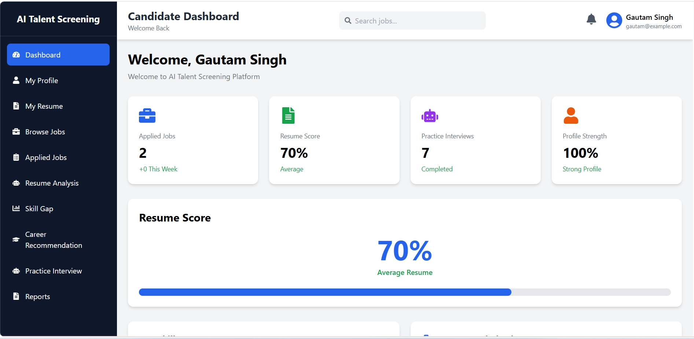
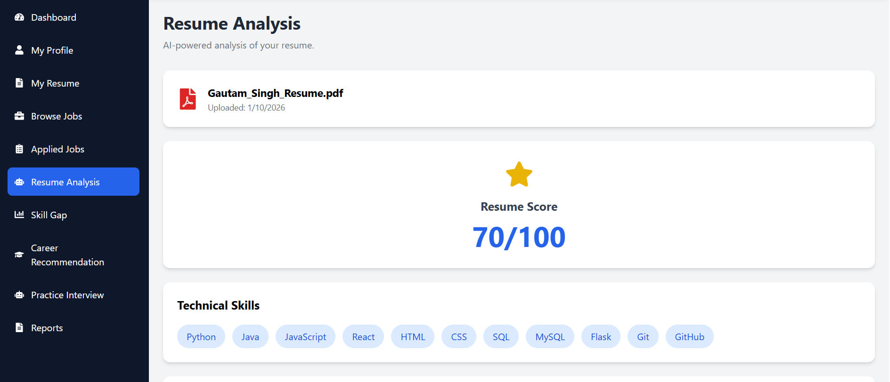
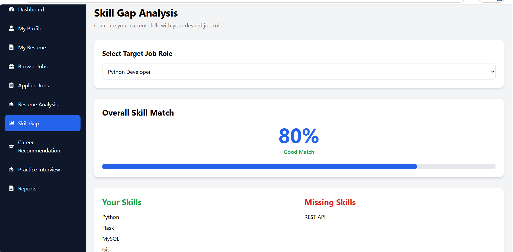
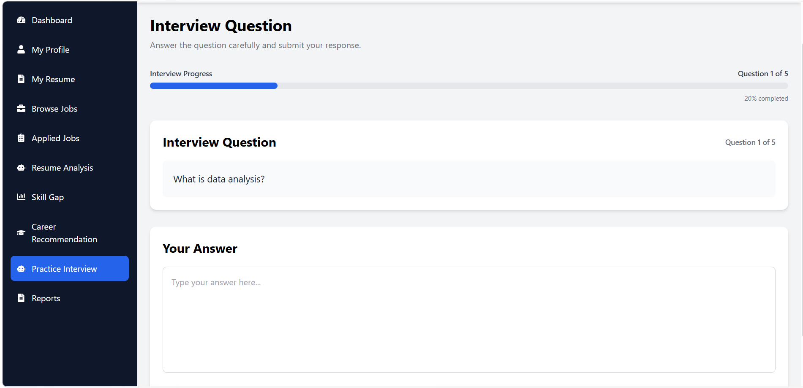
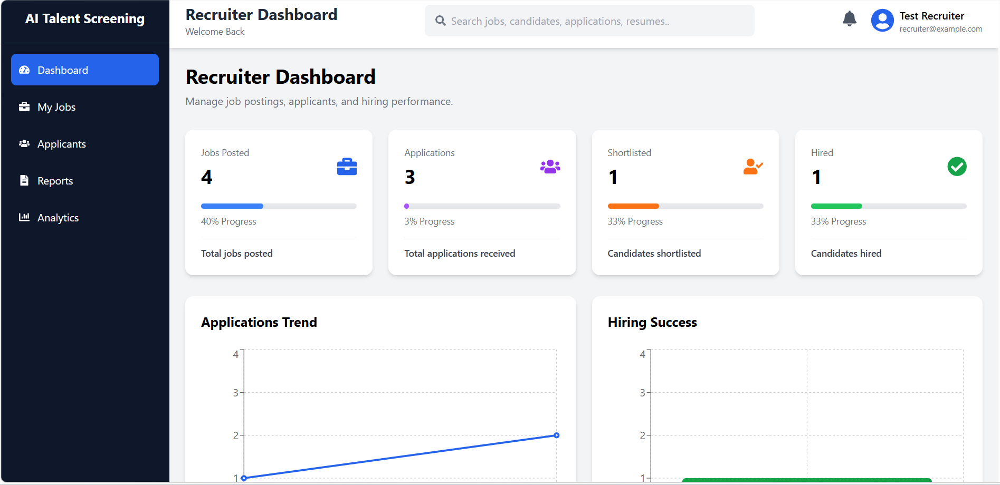

# AI Talent Screening & Career Intelligence Platform
An AI-powered recruitment and career guidance web application designed to help candidates analyze their resumes, identify skill gaps, explore career opportunities, and practice interviews, while helping recruiters manage recruitment activities.

## Features

### Candidate
* Candidate registration and authentication
* Resume upload and analysis
* Skill gap analysis
* Career recommendations
* Job browsing and applications
* AI-powered interview practice and feedback
* Candidate dashboard and reports

### Recruiter
* Recruiter dashboard and analytics
* Job posting and management
* Applicant review and candidate ranking
* Resume review
* Recruitment reports

### Admin
* User and recruiter management
* Job and application oversight
* Platform analytics and reports

## Technology Stack

**Frontend**
* React.js
* Tailwind CSS
* React Router
* Axios
* Recharts

**Backend**
* Python
* Flask
* REST APIs
* JWT authentication

**Database**
* MySQL

**AI and Document Processing**
* Sentence Transformers
* spaCy
* PyMuPDF

**Tools**
* Git and GitHub

## Project Screenshots
### Candidate Dashboard


### AI Resume Analysis


### Skill Gap Analysis


### AI Interview Practice


### Recruiter Dashboard


## Getting Started

### Prerequisites
* Node.js and npm
* Python 3
* MySQL
* Git

### 1. Clone the repository
```bash
git clone:  https://github.com/Gautamsingh98
cd ai-talent-screening-career-intelligence-platform
```

### 2. Start the backend
Open a terminal:
```bash
cd backend
python -m venv venv
```

Activate the virtual environment on Windows:
```bash
venv\Scripts\activate
```

Install the Python packages using the project's requirements file:
```bash
pip install -r requirements.txt
```

Configure your MySQL database and environment variables according to the project's configuration.

Start Flask:
```bash
python app.py
```

### 3. Start the frontend
Open a second terminal from the project root:
```bash
cd frontend
npm install
npm start
```

### Database Setup
Create and configure the MySQL database using the SQL schema or setup instructions included in the project. Update the database connection settings before running the backend.

## Learning Outcomes
This project provides practical experience in full-stack web development, REST API integration, database management, authentication, resume processing, and AI/NLP-based skill matching.

## Project Status
This project is under active development. Features and documentation are updated as development progresses.

## Author
**Gautam Singh**

GitHub: https://github.com/Gautamsingh98

LinkedIn: https://www.linkedin.com/in/gautam-singh-222759373
